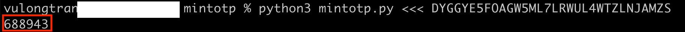
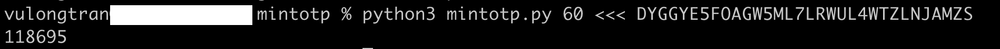
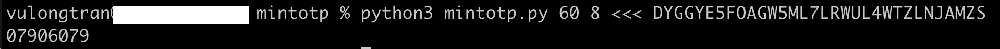
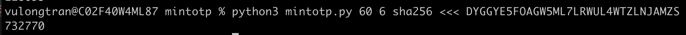

MinTOTP
=======

MinTOTP is a minimal TOTP generator written in Python.

[![View Source][Source SVG]][src]
[![MIT License][License SVG]][L]

[Source SVG]: https://img.shields.io/badge/view-source-brightgreen.svg
[src]: mintotp.py
[License SVG]: https://img.shields.io/badge/license-MIT-blue.svg

Contents
--------

* [Introduction](#introduction)
* [Install](#install)
* [Get Started](#get-started)
  * [Command Line Arguments](#command-line-arguments)
* [Optional](#optional)
* [Resources](#resources)
* [Source Code](#source-code)
* [License](#license)


Introduction
------------
<!-- ABOUT THE PROJECT -->
## About The Project
This project is built to demonstrate how to create a generate time-based one time (TOTP) passwords in the command line.

MinTOTP is a Python tool that can be used to generate TOTP (Time-Based One-Time Password) values.

This is will allow you to generates a new TOTP values.

Typically you will see these websites ask for you to scan or add a secret key (presented on the screen temporarily) for you to add to an authenticator app (e.g., Google Authenticator) on your mobile device which you must use to generate TOTP values for the purpose of logging into that account. .

It is powered by the `current time + secret key`  which you will find when you first set up two-factor authentication (2FA) multifactor for websites and services.

This aims on showing you how to generate these OTPs using the command line in your Terminal. 


Install
-------

MinTOTP can be used on any system with Python 3.4 or later installed on it. Once installed, we can work the [`mintotp.py`][src] source file directly.


###  GitHub
To get set up:

 1. Clone GitHub repository of this project and enter its top-level directory.

    ```shell
    git clone https://github.com/vulongtran/mintotp.git
    cd mintotp
    ```

 2. Test that [`mintotp.py`][src] works fine:

    ```shell
    python3 mintotp.py <<< DYGGYE5FOAGW5ML7LRWUL4WTZLNJAMZS
    ```

    A 6-digit TOTP value should appear as the output.

    

Get Started
-----------

Once installed and you have tested it is work.

We can now run few commands to quickly get started with MinTOTP.


### Command Line Arguments
Here is an overview of the command line arguments supported by this tool:

```
mintotp [TIME_STEP [DIGITS [DIGEST]]]
```

Here is a description of each argument:

  - `TIME_STEP`

    TOTP time-step duration (in seconds) during which a TOTP value is
    valid. A new TOTP value is generated after time-step duration
    elapses. (Default: `30`)

  - `DIGITS`

    Number of digits in TOTP value. (Default: `6`)

  - `DIGEST`

    Cryptographic hash algorithm to use while generating TOTP value.
    (Default: `sha1`)

    Possible values are `sha1`, `sha224`, `sha256`, `sha384`, and
    `sha512`.

## Using our Secret Key (Base32 Key)

Here are some usage examples of using our Secret Key (Base32 Key) through the command line:

 1. Generate TOTP value with a time-step size of 60 seconds:

    ```shell
    python3 mintotp.py 60 <<< DYGGYE5FOAGW5ML7LRWUL4WTZLNJAMZS
    ```
    

 2. Generate 8-digit TOTP value (notice the 8 digit characters):

    ```shell
    python3 mintotp.py 60 8 <<< DYGGYE5FOAGW5ML7LRWUL4WTZLNJAMZS
    ```
 
    

 3. Use SHA-256 hash algorithm to generate TOTP value:

    ```shell
    python3 mintotp.py 60 6 sha256 <<< DYGGYE5FOAGW5ML7LRWUL4WTZLNJAMZS
    ```
    


Optional
-----------
### (Optional) Compare our Secret Key with our Authenticator app

We can compare our Secret Key (Base32 Key) aligns with our Authenticator app.

 1. Enter this command:

    ```shell
    mintotp <<< DYGGYE5FOAGW5ML7LRWUL4WTZLNJAMZS
    ```

    The output should be a 6-digit TOTP value.

 2. Add the following key to a TOTP-based authenticator app:

    ```
    DYGGYE5FOAGW5ML7LRWUL4WTZLNJAMZS
    ```

    For example, if you have Google Authenticator on your mobile phone,
    open it, tap the button with plus sign, select "Enter a provided key", enter any account name and "Time-based" and enter the above key. Set the dropdown menu to "Time-based" and tap the "Add" button. A 6-digit TOTP value should appear for the new key.

 3. Run the command in step 1 again and verify that the TOTP value  printed by the Python program matches the TOTP value that appears in your authenticator app.


Resources
---------

Here is a list of useful links about this project:

  - [Documentation](https://github.com/vulongtran/mintotp#readme)
  - [Main python script - minitotp.py](https://github.com/vulongtran/mintotp/blob/master/mintotp.py) - this is where the main python script we are using sits. 
  - [Original MinTOTP Source code](https://github.com/susam/mintotp) - the original developer source code with other functions, such as QR codes if you prefer to use that.


Source Code
-----------

The source code in [`mintotp.py`][src] generates TOTP values from a secret key and current time.  

At the heart of the TOTP algorithm lies the HOTP algorithm. HOTP stands for HMAC-based One-Time Password. HMAC stands for Hash-based Message Authentication Code. Here are the relevant RFCs to learn more about these algorithms:

  - [RFC 2104]: HMAC: Keyed-Hashing for Message Authentication
  - [RFC 4226]: HOTP: An HMAC-Based One-Time Password Algorithm
  - [RFC 6238]: TOTP: Time-Based One-Time Password Algorithm

[RFC 2104]: https://tools.ietf.org/html/rfc2104
[RFC 4226]: https://tools.ietf.org/html/rfc4226
[RFC 6238]: https://tools.ietf.org/html/rfc6238

License
-------

This is free and open source software. You can use, copy, modify, merge, publish, distribute, sublicense, and/or sell copies of it, under the terms of the MIT License. See [LICENSE.md][L] for details.

This software is provided "AS IS", WITHOUT WARRANTY OF ANY KIND, express or implied. See [LICENSE.md][L] for details.

[L]: LICENSE.md